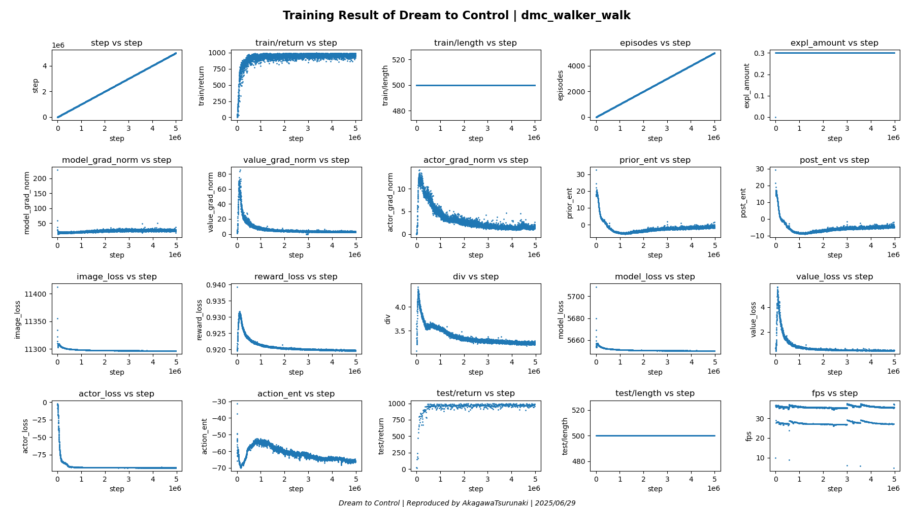

# Note

Forked and tested by [AkagawaTsurunaki](https://github.com/AkagawaTsurunaki/dreamer).

Tensorflow 2.14 and newer dependencies are supported by this version of Dreamer.

## Start-up

> [!CAUTION]
> 
> There is a memory leak, please be careful to monitor your memory usage.

### Environment:
- OS: Ubuntu 24.10
- GPU: NVIDIA GeForce RTX 4090 * 2 (avg 75% memory used per card for `float32`)
- Memory: 184 GiB (avg 7.7% used)
- Python: 3.10

Suppose you have Anaconda installed. Then you can use `environment.yml` to setup your Anaconda environment.

```
conda env update --name dreamer --file environment.yml
```

Activate your environment and check if your GPU devices are available.

```
conda activate dreamer
python test_gpu_available.py
```

## Reproduction Result

### DeepMind Control - Walker Walk Task



## Old version

> [!CAUTION]
>
> The old version of Dreamer may cause `Segmentation fault` or even crash your OS!
> And it may product `NAN` value to break your training process.

If you want to reproduce Dreamer based on the old version of Dreamer, please see the [commit](https://github.com/danijar/dreamer/commit/56d4d444dfd0582b0e79dab80aebbea74c0ce40d).

To setup the enviroment, run the following commands:

```
conda create --name dreamer python=3.8 --yes
conda activate dreamer
pip install -r requirements.txt
conda install cudatoolkit=10.1 cudnn
```

## Contact with Me

**Email:** AkagawaTsurunaki@outlook.com